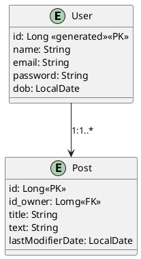
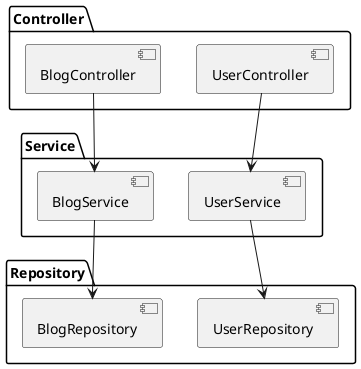
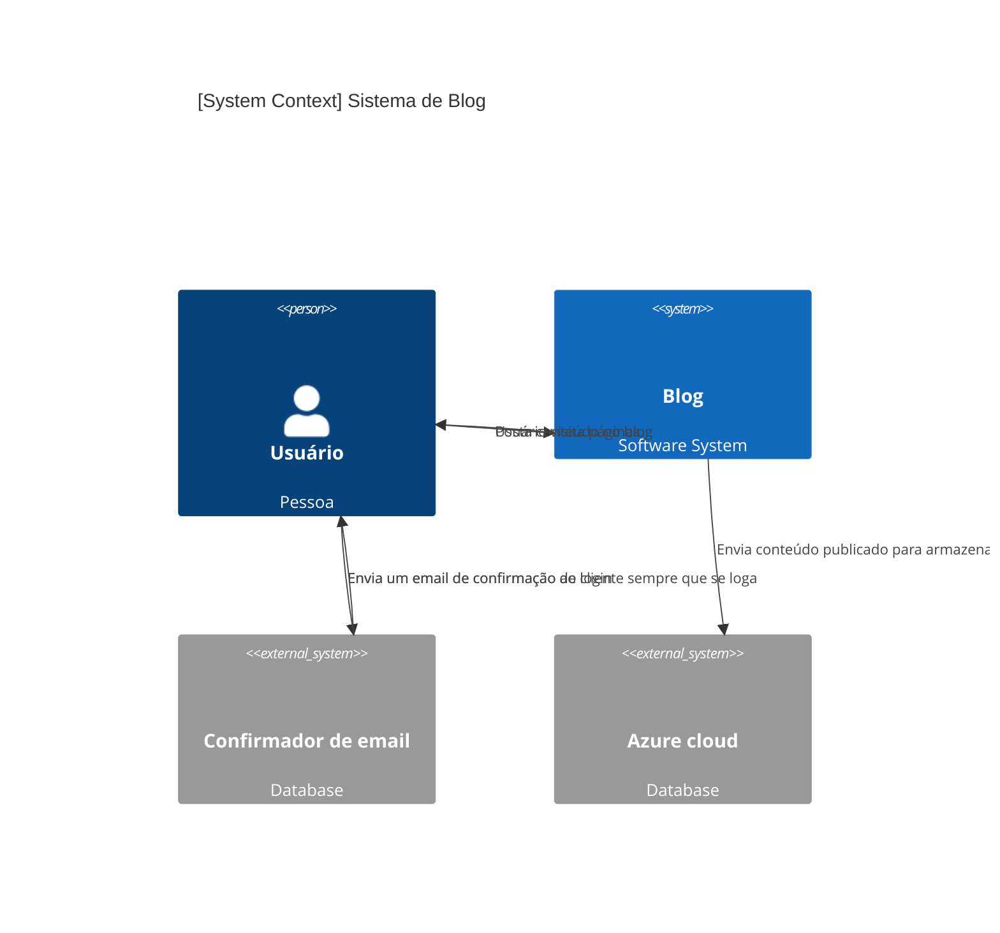
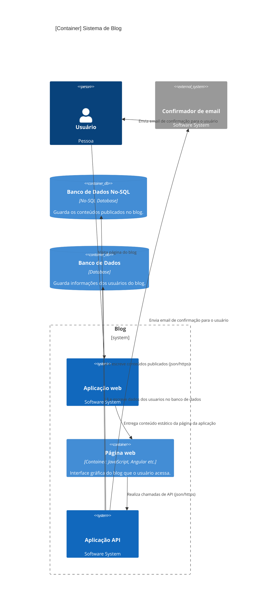
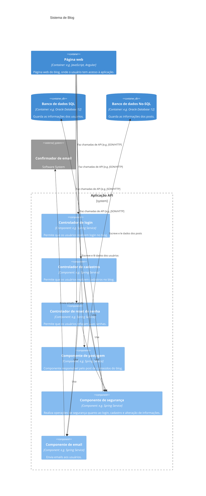

<h1>Arc42 Sistema Blog</h1>
<h2>Grupo: Cesar, Felipe Sphair, Otavio, Rodrigo Munch</h2>

1 Introdução e Objetivos
1.1 Visão Geral dos Requisitos

O sistema descrito é uma plataforma de blog que permite aos usuários cadastrados visualizar, postar e comentar em conteúdos. O sistema inclui funcionalidades essenciais para proporcionar uma experiência de usuário robusta e segura, como a confirmação de login via email e o armazenamento seguro de conteúdos na nuvem.

O principal objetivo do sistema é facilitar a interação entre os usuários e o compartilhamento de informações em um ambiente seguro. A confirmação de login por email adiciona uma camada extra de segurança, aumentando a confiança dos usuários na plataforma.

Entre os requisitos funcionais mais importantes, destacam-se:

- Os usuários devem poder criar, visualizar, editar e excluir postagens no blog.
- O sistema deve enviar um email de confirmação sempre que um usuário realizar login.
- Todos os conteúdos postados pelos usuários devem ser armazenados de forma segura na Azure Cloud.
- A aplicação web deve ser responsiva e suportar diferentes dispositivos, como desktops, celulares e tablets.
- Os usuários devem poder comentar em postagens existentes.

1.2 Metas de Qualidade

As metas de qualidade do sistema são fundamentais para garantir que a arquitetura atenda às expectativas dos principais stakeholders. As metas mais relevantes incluem:

- Segurança Garantir que os dados dos usuários e os conteúdos publicados sejam protegidos contra acessos não autorizados, com foco na autenticação e no armazenamento seguro.
- Desempenho A aplicação deve responder rapidamente às ações dos usuários, assegurando uma experiência de uso fluida, especialmente em operações de criação, leitura, atualização e exclusão (CRUD) e no carregamento de páginas.
- Escalabilidade O sistema deve ser capaz de suportar um aumento significativo no número de usuários e no volume de dados, sem comprometer o desempenho ou a disponibilidade.
- Usabilidade A interface do usuário deve ser intuitiva e fácil de usar, proporcionando uma experiência agradável mesmo para usuários com pouca experiência técnica.
- Manutenibilidade A arquitetura deve permitir fácil atualização e modificação dos componentes, facilitando a manutenção e a integração de novas funcionalidades ao longo do tempo.

1.3 Stakeholders

Os stakeholders envolvidos no desenvolvimento e operação do sistema possuem diferentes expectativas e necessidades em relação à arquitetura. É essencial compreender as expectativas de cada grupo para garantir que a arquitetura atenda a todos de forma adequada:

- Usuário Final Espera uma interface intuitiva, segura e confiável para a publicação e visualização de conteúdos.
- Administrador do Sistema Necessita de um sistema fácil de gerenciar, com boas ferramentas de monitoramento e controle de segurança.
- Desenvolvedores Precisam de uma arquitetura modular e bem documentada, que facilite o desenvolvimento contínuo e a manutenção do sistema.
- Gerente de Projeto Espera que o sistema seja entregue dentro dos prazos estabelecidos, com alta qualidade e atendendo a todos os requisitos funcionais e não funcionais.
- Fornecedor de Infraestrutura (Azure Cloud) Responsável por fornecer e manter a infraestrutura de nuvem utilizada pelo sistema, garantindo a disponibilidade e segurança dos dados.

2 Restrições de Arquitetura

As restrições de arquitetura limitam a liberdade dos arquitetos de software nas decisões de design e implementação. Estas restrições são impostas por requisitos organizacionais, políticos ou técnicos:

- Tecnológicas A aplicação deve ser desenvolvida utilizando o framework Angular para o frontend e uma API RESTful para o backend. Além disso, o sistema deve utilizar a Azure Cloud para o armazenamento de dados e serviços de computação.

- Organizacionais A implementação do sistema deve seguir as diretrizes de segurança e conformidade estabelecidas pela Lei Geral de Proteção de Dados (LGPD) no Brasil.

- Políticas O sistema deve estar em conformidade com as políticas internas de segurança da informação da organização.

- Convenções A codificação deve seguir as convenções de nomenclatura e estrutura estabelecidas pela equipe de desenvolvimento, garantindo a consistência e a manutenibilidade do código.

3 Contexto e Escopo
3.1 Contexto de Negócio

O sistema de blog interage com diferentes parceiros de comunicação, como serviços de email para confirmação de login e a Azure Cloud para o armazenamento de conteúdos. É essencial que todos os stakeholders compreendam como o sistema se comunica com seus parceiros:

- Usuário Final O usuário interage diretamente com o sistema, realizando login, postando conteúdos e comentando em postagens. O sistema, em troca, fornece páginas do blog e envia emails de confirmação.

- Serviço de Email O sistema solicita ao serviço de email que envie uma confirmação de login para o usuário sempre que ele tentar acessar a plataforma.

- Azure Cloud A Azure Cloud é responsável pelo armazenamento seguro dos conteúdos postados pelos usuários, bem como pela recuperação desses dados quando necessário.

3.2 Contexto Técnico

O sistema comunica-se com seu ambiente técnico através de interfaces específicas, utilizando protocolos de comunicação padrão. As interfaces técnicas são fundamentais para garantir a integração correta entre os componentes do sistema e o ambiente externo:

- HTTP/HTTPS: Utilizado para comunicação entre a aplicação web e a API RESTful, permitindo operações de CRUD e o carregamento de páginas.

- SMTP (Serviço de Email) Utilizado para enviar emails de confirmação de login aos usuários, garantindo a segurança do processo de autenticação.

- Azure Blob Storage Responsável pelo armazenamento e recuperação dos dados dos conteúdos postados pelos usuários na nuvem.

- O sistema de blog faz uso do Azure Service Bus para comunicação assíncrona entre microserviços e Azure Functions. Essa escolha arquitetural melhora a resiliência do sistema, permitindo recuperação de falhas e maior desacoplamento entre serviços, embora introduza uma leve latência. O monitoramento de performance será implementado para garantir que a latência seja minimizada e não impacte a experiência do usuário.

Cada uma dessas interfaces desempenha um papel crucial no funcionamento do sistema, garantindo que os dados sejam transmitidos de forma segura e eficiente entre os diferentes componentes.

4 Soluções de Design

O sistema de blog foi projetado utilizando uma arquitetura baseada em microserviços, com o uso de Azure Functions para realizar operações CRUD de forma modular e escalável. A escolha da arquitetura foi feita para atender os requisitos de escalabilidade e facilidade de manutenção.

Principais decisões de design incluem:

- Utilização de Azure Functions para o backend, com endpoints REST para realizar operações de criar, ler, atualizar e deletar posts do blog.

- Angular no frontend para fornecer uma interface dinâmica e responsiva.

- Armazenamento de dados no Azure Blob Storage, garantindo segurança e escalabilidade.

- Autenticação via e-mail para reforçar a segurança do sistema, confirmando o login dos usuários através de e-mails.

5 Estrutura do Sistema

A arquitetura do sistema de blog é composta por módulos independentes que interagem de forma clara e eficiente, incluindo:

- Frontend (Angular): O usuário acessa a interface gráfica do blog, onde pode criar, editar e excluir posts.

- Backend (Azure Functions): Processa todas as requisições HTTP, realizando as operações CRUD nos posts do blog.

- Armazenamento (Azure Blob Storage): Todos os dados dos posts e seus metadados são armazenados de maneira segura na Azure Cloud.

- Serviços de E-mail: Um serviço SMTP é utilizado para enviar notificações de login e outros eventos relacionados ao usuário.

- Para o Backend for Frontend (BFF), o sistema utiliza Azure Container Apps, que oferece escalabilidade automática, permitindo ao sistema responder a picos de tráfego sem comprometer a disponibilidade. Ferramentas de monitoramento de custos serão implementadas para controlar os gastos em períodos de alta demanda, prevenindo custos operacionais excessivos.

6 Mapeamento de Building Blocks

A arquitetura do sistema pode ser visualizada em componentes distintos que se comunicam por meio de APIs REST:

-Frontend Angular: Envia requisições HTTP para a API do backend, processando a interação do usuário.

-Azure Functions: Endpoints HTTP que executam as operações CRUD. Exemplo:

    - `GET /api/blog?title={title}`: Busca uma postagem com base no título.
    - `POST /api/blog`: Cria uma nova postagem.
    - `PUT /api/blog`: Atualiza uma postagem existente.
    - `DELETE /api/blog?title={title}`: Deleta uma postagem com base no título.
-Armazenamento (Azure Blob Storage): Armazena o conteúdo dos posts de maneira eficiente e segura.

7 Roteiro de Runtime

O comportamento do sistema durante a execução de operações pode ser exemplificado por cenários:

Cenário 1: Criação de um novo post:

- O usuário insere os dados no frontend (título, texto).

- O frontend envia uma requisição `POST` para o backend.

- O backend armazena o post no Azure Blob Storage.

- Uma resposta de sucesso é retornada ao frontend.

Cenário 2: Leitura de um post existente:

- O usuário solicita a visualização de um post.

- O frontend faz uma requisição `GET` com o título da postagem.

- O backend retorna o post armazenado no Azure Blob Storage.

8 Visão de Implantação

A aplicação é implantada utilizando serviços da Azure, com foco em escalabilidade e facilidade de gerenciamento:

- Azure App Services: Hospeda o frontend Angular.

- Azure Functions: Funções serverless que gerenciam as operações CRUD.

- Azure Blob Storage: Armazena de forma escalável e segura o conteúdo do blog.

- Serviço SMTP: Gerencia o envio de e-mails para a autenticação dos usuários.

8.1 Diagrama entidade relacionamento

8.2 Diagrama de componentes

User

| Coluna   | Tipo de Dado | Descrição |
|----------|--------------|---------------|
| id       | Long         | Id único de usuário |
| name     | String       | Nome/nick do usuário |
| email    | String       | Email do usuário |
| password | String       | Senha única do usuário |
| dob      | localDate    | Data de criação do usuário |
Post

| Coluna           | Tipo de Dado | Descrição |
|------------------|--------------|---------------|
| id               | Long         | Id único do post |
| id_owner         | Long         | Id único do usuário que efetuou o post |
| title            | String       | Título do post |
| text             | String       | Texto/conteudo do post |
| lastModifiedDate | LocalDate    | Data e horário da postagem ou ultima modificação do post |

9 Conceitos Crosscutting

O sistema utiliza um API Gateway da AWS para roteamento de requisições e autenticação centralizada, o que melhora a segurança e facilita o controle de acesso aos microserviços. Para evitar que o API Gateway se torne um ponto único de falha, serão implementadas estratégias de redundância e failover, garantindo alta disponibilidade do sistema mesmo em caso de falhas no gateway.

10 Design Decisões

- Azure Functions: Escolhidas por serem serverless, permitindo que o sistema escale de acordo com a demanda e reduzindo custos operacionais.
- Azure Blog Storage: Ideal para armazenar grandes volumes de dados com alta disponibilidade e segurança.
- Autenticação via e-mail: A escolha por autenticação via e-mail foi feita para garantir que apenas usuários autorizados possam realizar operações no sistema.

ATAM

Fase 1: Apresentação

Visão Geral do Sistema: O sistema é uma aplicação de blog que utiliza a arquitetura orientada por eventos, com integração entre microserviços, Azure Functions e Azure Service Bus. Ele inclui um BFF (Backend for Frontend) no Azure Container Apps e um API Gateway da AWS para gerenciar requisições. O armazenamento dos dados pode ser feito no SQL Server ou MongoDB, e os eventos entre os microserviços são processados via Azure Service Bus.

Fase 2: Investigação de Cenários

Cenário 1: Integração de Microserviços com Azure Functions via Azure Service Bus
-	Atributo de Qualidade (ISO 25010:2023): Desempenho e Resiliência.
-	Decisão Arquitetural: Uso do Azure Service Bus para comunicação assíncrona entre microserviços e Azure Functions.
-	Trade-offs: Introdução de latência devido à comunicação assíncrona, mas aumento da resiliência do sistema, permitindo melhor escalabilidade.
-	Resultados: Garantia de uma arquitetura mais desacoplada, com melhor capacidade de recuperação de falhas, mesmo com latência adicional.

Cenário 2: Escalabilidade do BFF no Azure Container Apps
-	Atributo de Qualidade (ISO 25010:2023): Escalabilidade e Custo.
-	Decisão Arquitetural: Implementação de BFF no Azure Container Apps, utilizando escalabilidade automática.
-	Trade-offs: Custos adicionais em períodos de alto uso, mas manutenção da alta disponibilidade e resposta rápida a picos de tráfego.
-	Resultados: O sistema pode escalar de forma automática, garantindo que a performance não seja comprometida, com a necessidade de monitorar e controlar custos.

Cenário 3: Segurança no API Gateway AWS
-	Atributo de Qualidade (ISO 25010:2023): Segurança e Disponibilidade.
-	Decisão Arquitetural: Uso do API Gateway AWS para autenticação centralizada e roteamento de requisições.
-	Trade-offs: Potencial ponto único de falha no gateway, mas simplificação do controle de segurança e gestão de tráfego.
-	Resultados: Melhor controle sobre quem acessa os serviços backend, com a necessidade de implementar redundância para evitar falhas de serviço.

Fase 3: Avaliação dos Atributos de Qualidade

-	Desempenho e Resiliência (Cenário 1): A escolha de uma arquitetura orientada a eventos melhora a resiliência do sistema. No entanto, a latência introduzida pela comunicação assíncrona deve ser monitorada para evitar impacto no tempo de resposta.
-	Escalabilidade e Custo (Cenário 2): O uso de Azure Container Apps facilita a escalabilidade automática, mas os custos operacionais podem crescer rapidamente, exigindo monitoramento contínuo.
-	Segurança (Cenário 3): O API Gateway oferece segurança centralizada, mas deve ser configurado para garantir alta disponibilidade, prevenindo que se torne um ponto de falha no sistema.

Fase 4: Identificação de Riscos e Sensibilidades

-	Risco 1: Latência nos Eventos (Cenário 1)
    -	Descrição: A comunicação assíncrona via Azure Service Bus pode introduzir latência perceptível para o usuário.
    -	Recomendação: Implementar técnicas de otimização de filas e monitoramento de performance para reduzir a latência.

-	Risco 2: Custos de Escalabilidade Automática (Cenário 2)
    -	Descrição: A escalabilidade automática do Azure Container Apps pode gerar custos elevados durante picos de uso.
    -	Recomendação: Utilizar ferramentas de monitoramento de custos e definir limites de uso para evitar gastos excessivos.

-	Risco 3: Ponto Único de Falha no API Gateway (Cenário 3)
    -	Descrição: O API Gateway pode se tornar um ponto único de falha, impactando o acesso aos microserviços.
    -	Recomendação: Implementar redundância e failover no API Gateway para garantir alta disponibilidade.

11 Qualidade

As metas de qualidade são garantidas por:

As metas de qualidade do sistema incluem resiliência, escalabilidade e segurança. A resiliência é melhorada pelo uso do Azure Service Bus para comunicação assíncrona entre microserviços, permitindo uma arquitetura mais desacoplada e com maior capacidade de recuperação de falhas. A escalabilidade é garantida pelo Azure Container Apps, que possibilita a adaptação do sistema a variações de tráfego, com monitoramento de custos para evitar gastos excessivos. A segurança é reforçada pelo uso de um API Gateway da AWS com redundância e failover, assegurando controle centralizado de autenticação e alta disponibilidade.

12 Riscos e Problemas Técnicos

- Falhas no serviço de e-mail: Caso o serviço de SMTP falhe, o login dos usuários pode ser comprometido.
- Disponibilidade da Azure: Interrupções nos serviços da Azure podem afetar a disponibilidade do sistema.
- Segurança: O sistema deve ser revisado periodicamente para evitar vulnerabilidades em bibliotecas ou no serviço de e-mail.
- Risco de Latência nos Eventos: A comunicação assíncrona via Azure Service Bus pode introduzir latência perceptível ao usuário. Mitigação: Implementar otimização de filas e monitoramento de performance para reduzir a latência.
- Risco de Custos Elevados com Escalabilidade Automática: A escalabilidade automática do Azure Container Apps pode aumentar significativamente os custos durante picos de uso. Mitigação: Utilizar ferramentas de        monitoramento de custos e estabelecer limites de uso para evitar gastos excessivos.
- Ponto Único de Falha no API Gateway: O API Gateway pode ser um ponto de falha único, comprometendo o acesso aos microserviços em caso de problemas. Mitigação: Implementar redundância e failover no API Gateway para garantir alta disponibilidade.

13 Glossário
Azure Functions: Serviço de computação serverless da Azure que permite executar funções de forma escalável, cobrando apenas pelo tempo de execução. Utilizado para operações CRUD no sistema de blog.

API REST: Interface de programação de aplicativos baseada no estilo arquitetural REST (Representational State Transfer). A API é usada para permitir que o frontend Angular interaja com o backend e realize operações de criar, ler, atualizar e deletar (CRUD).

CRUD: Acrônimo para Create, Read, Update e Delete. Refere-se às operações básicas de manipulação de dados no sistema de blog.

Frontend: A parte da aplicação que é visível e com a qual o usuário interage diretamente, desenvolvida usando Angular.

Backend: A parte do sistema responsável pelo processamento de lógica de negócios e manipulação de dados. No sistema de blog, é implementado com Azure Functions.

Azure Blob Storage: Serviço de armazenamento da Azure usado para guardar dados em blobs. No sistema de blog, é utilizado para armazenar o conteúdo dos posts e seus metadados.

Autenticação via E-mail: Método de verificação da identidade do usuário através do envio de um e-mail de confirmação para login no sistema, garantindo maior segurança.

SMTP (Simple Mail Transfer Protocol): Protocolo de internet utilizado para o envio de e-mails. Utilizado para enviar confirmações de login no sistema de blog.

LGPD (Lei Geral de Proteção de Dados): Lei brasileira que regula o tratamento de dados pessoais e garante a proteção de informações sensíveis. O sistema de blog deve estar em conformidade com a LGPD.

Escalabilidade: Capacidade do sistema de aumentar sua eficiência e desempenho conforme o volume de dados e o número de usuários cresce, sem comprometer a experiência do usuário.

Serverless: Modelo de execução em que o provedor de serviços de nuvem aloca automaticamente os recursos de computação conforme necessário, cobrando apenas pelo tempo de execução das funções.

14 Endpoints de Backend e Azure Functions

1 - GET `/api/blog?title={title}`

        Descrição: Recupera um post do blog com base no título fornecido.

        Exemplo: `/api/blog?title=SamplePostTitleee`

        Resposta:
        {
            "id": "66e10ec234674a07642a13f6",
            "id_owner": 123456789,
            "title": "SamplePostTitleee",
            "text": "This is the content of the sample post.",
            "lastModifiedDate": "2024-09-11"
        }

2 - POST `/api/blog`

        Descrição: Cria um novo post no blog.

        Exemplo de Corpo da Requisição:
        {
            "id_owner": 123456789,
            "title": "DeployAzure",
            "text": "This is the content of the sample post."
        }
    

3 - PUT `/api/blog`

        Descrição: Atualiza um post existente com base no título.

        Exemplo de Corpo da Requisição:
        {
            "oldTitle": "Sample Post Title",
            "newTitle": "Updated Post Title",
            "idOwner": 123456789,
            "text": "This is the updated content of the sample post."
        }
    

4 - DELETE `/api/blog?title={title}`

        Descrição: Exclui um post do blog com base no título fornecido.

        Exemplo: `/api/blog?title=UpdatedPostTitle`

15 Diagramas C4

Nível 1

Nível 2

Nível 3

